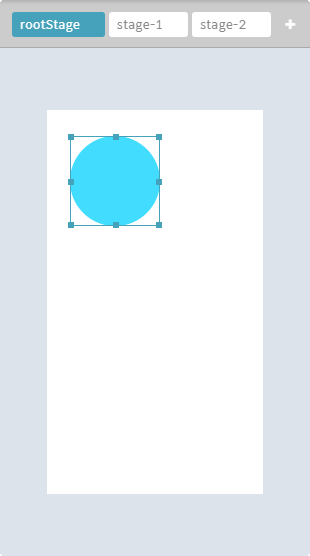
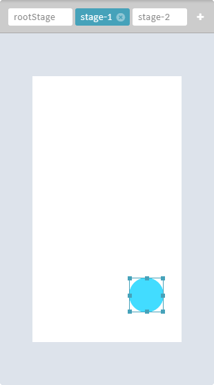
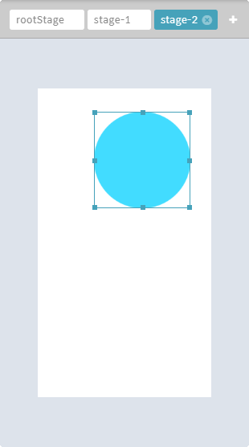
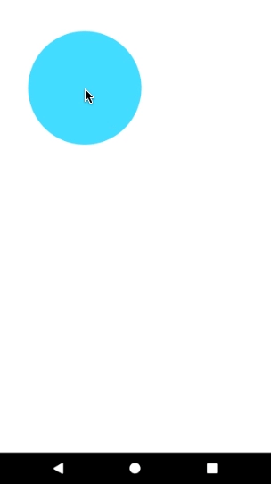
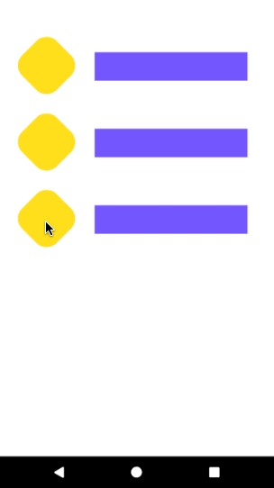
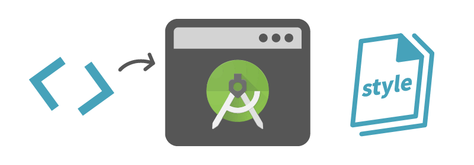
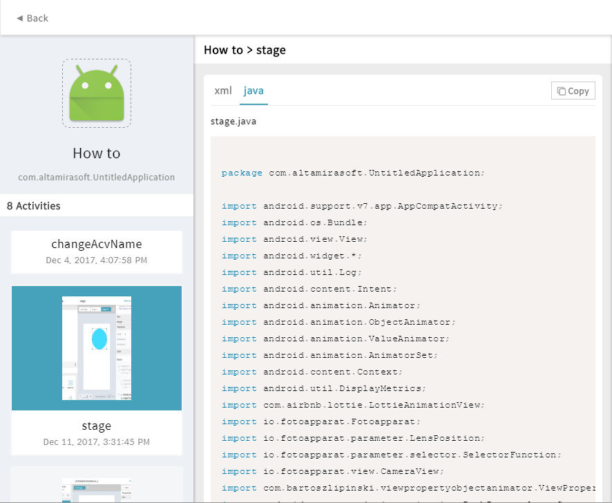

## 데스크톱 애플리케이션입니다.

vxmaker는 모바일 앱 모션을 쉽게 작업하여 개발용 안드로이드 소스코드로 추출합니다. 오픈소스 프로젝트이며 베타버전을 배포합니다.

 

## 설치 방법은 이렇습니다.

### [다운로드 페이지](https://vxmaker.com/)
----
### 개발 모드 설치

윈도우즈에서는 npm install 시, **sudo** 명령어 대신 **관리자 권한으로 실행**을 사용할 것

~~~~
1. node.js 설치 및 버전 체크
https://nodejs.org

2. npm update 
sudo npm install -g npm

3. angular cli 설치
https://github.com/angular/angular-cli
sudo npm install -g @angular/cli

4. typescript 설치
sudo npm install -g typescript

5. electron 설치 
sudo npm install -g electron
/에러 발생할 때: 
sudo npm install -g electron --unsafe-perm=true --allow-root

6. concurrently 설치
sudo npm install -g concurrently
~~~~

~~~~
소스 다운로드 후 

7. angular의 npm 모듈 설치
위치: 프로젝트 root폴더
npm install

8. electron의 npm 모듈 설치
위치: cd src/electron
npm install

9. 실행
위치: 프로젝트 root폴더
npm start
~~~~

 

## 안드로이드 앱의 움직임을 만듭니다.

안드로이드 액티비티의 내부 액션을 여러 스테이지로 분할, 각각 다른 속성의 스테이지로 편집하여 모션을 구현합니다. 
생성된 앱 레이아웃과 모션을 네이티브 코드로 추출합니다.
 
 

### stage

스테이지는 일종의 키프레임입니다. 스테이지를 추가하고 속성을 편집하세요.

rootStage | stage1 | stage2
:-------: | :-------: | :-------:
 |  | 
 

### stageChange

편집한 스테이지를 전환시키는 이벤트입니다. 전환되는 스테이지에 따라 부드러운 움직임을 연출합니다.

size & position | transparency | rotation
:-------: | :-------: | :-------:
 |  | 
 

### codeExport

모션 및 디자인 작업을 완료하였다면, 그것들을 개발용 소스로 내보내기 합니다.

 
 
 

## 이런 사용자들에게 유용합니다.

* 프론트엔드 개발자
* 모션 그래픽 디자이너
* 기타 앱 개발팀
* 앱 기획팀
* 학생

 
 

## 튜토리얼

 
 

## 제작 목적

안드로이드 개발자에게 복잡한 모션 개발과 리소스 추출작업의 단순화를 목적으로 제작되었습니다. 
자세한 정보는 [이 곳에서](https://vxmaker.com/pages/kr/learn/learn.html) 얻을 수 있습니다.
 
 

## 오픈소스입니다.
vxmaker는 (주)알타미라소프트가 배포하는 오픈소스 프로그램입니다. 
개인 및 기업 사용자가 자유롭게 사용, 수정 및 재배포 가능합니다.
 
 

## License
The MIT License (MIT)

Copyright (C) 2017, [Altamirasoft Inc.](http://altamirasoft.com/) All rights reserved.

Permission is hereby granted, free of charge, to any person obtaining a copy of this software and associated documentation files (the "Software"), to deal in the Software without restriction, including without limitation the rights to use, copy, modify, merge, publish, distribute, sublicense, and/or sell copies of the Software, and to permit persons to whom the Software is furnished to do so, subject to the following conditions:

The above copyright notice and this permission notice shall be included in all copies or substantial portions of the Software.

THE SOFTWARE IS PROVIDED "AS IS", WITHOUT WARRANTY OF ANY KIND, EXPRESS OR IMPLIED, INCLUDING BUT NOT LIMITED TO THE WARRANTIES OF MERCHANTABILITY, FITNESS FOR A PARTICULAR PURPOSE AND NONINFRINGEMENT. IN NO EVENT SHALL THE AUTHORS OR COPYRIGHT HOLDERS BE LIABLE FOR ANY CLAIM, DAMAGES OR OTHER LIABILITY, WHETHER IN AN ACTION OF CONTRACT, TORT OR OTHERWISE, ARISING FROM, OUT OF OR IN CONNECTION WITH THE SOFTWARE OR THE USE OR OTHER DEALINGS IN THE SOFTWARE.
